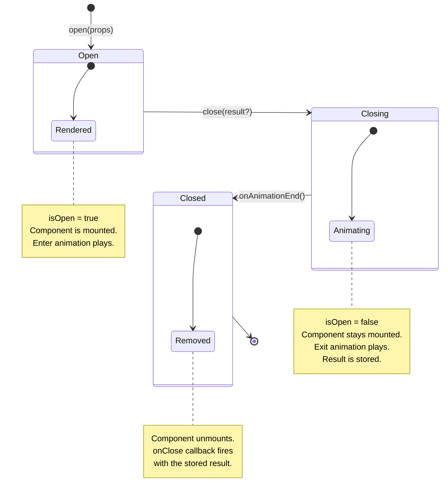

# react-overlay-stack

Type-safe, unstyled overlay manager for React with animation lifecycle and
stacking support.

## Installation

```shell
yarn add react-overlay-stack
```

Peer dependencies: `react >=19` and `react-dom >=19`.

## Quick Start

A typical setup has three parts: the **system** (created once), **overlay
definitions** (one per overlay type), and **call sites** (any component that
opens an overlay). This is similar to how you would set up a Zustand store or a
React Query client.

### 1. Create the overlay system

`createOverlaySystem()` returns a scoped hook and provider. Create it once and
export both for the rest of your app to use. Every component that imports from
this file shares the same overlay stack.

```ts
// src/lib/overlay-system.ts
import { createOverlaySystem } from "react-overlay-stack";

export const { useOverlay, OverlayProvider } = createOverlaySystem();
```

### 2. Define an overlay

Each overlay pairs a component with its props and result types via
`defineOverlay<TProps, TResult>()`. Place definitions wherever makes sense for
your project, for example alongside the feature they belong to or in a shared
overlays directory.

```tsx
// src/overlays/confirm-dialog.tsx
import { defineOverlay } from "react-overlay-stack";

export const ConfirmDialog = defineOverlay<{ title: string }, boolean>(
  ({ title, controller }) => (
    <div>
      <h2>{title}</h2>
      <button onClick={() => controller.close(true)}>Confirm</button>
      <button onClick={() => controller.close(false)}>Cancel</button>
    </div>
  ),
);
```

The generic parameters encode the props and the return type. Every call site
that opens this overlay gets full type safety on both.

### 3. Open from any component

The call site does not deal with rendering, animation, or z-index. It calls
`open()` with typed props and receives the typed result in the callback.

```tsx
// src/pages/settings.tsx
import { useOverlay } from "../lib/overlay-system";
import { ConfirmDialog } from "../overlays/confirm-dialog";

const Settings = () => {
  const confirm = useOverlay(ConfirmDialog);

  const handleDelete = () => {
    confirm.open({ title: "Delete account?" }, (confirmed) => {
      if (confirmed) deleteAccount();
    });
  };

  return <button onClick={handleDelete}>Delete Account</button>;
};
```

`open()` returns an instance ID if you need to close it imperatively:

```tsx
const id = confirm.open({ title: "Are you sure?" });
confirm.close(id, false);

// Or close all open instances at once
confirm.closeAll();
```

### 4. Add the provider

Wrap your app with the `OverlayProvider` so overlays can render into the tree.

```tsx
// src/app.tsx
import { OverlayProvider } from "./lib/overlay-system";

const App = () => (
  <OverlayProvider>
    <Router />
  </OverlayProvider>
);
```

### Animation Lifecycle

Unlike libraries that unmount overlays immediately on close,
`react-overlay-stack`
uses a two-phase close: the overlay stays mounted during the exit animation and
is only removed from the DOM after you signal that the animation has finished.
See the [lifecycle diagram](#instance-lifecycle) for the full state machine.

Use `useOverlayContext()` inside your overlay to read `isOpen` and call
`onAnimationEnd()` when the exit animation completes:

```tsx
import { useOverlayContext } from "react-overlay-stack";

const { isOpen, onAnimationEnd } = useOverlayContext();

<div
  style={{ opacity: isOpen ? 1 : 0, transition: "opacity 200ms" }}
  onTransitionEnd={() => {
    if (!isOpen) onAnimationEnd();
  }}
/>;
```

The `!isOpen` guard is important! Without it, animation events firing during
the enter transition would remove the overlay immediately.

To skip the exit animation entirely, call `onAnimationEnd()` as soon as
`isOpen` becomes `false`:

```tsx
const { isOpen, onAnimationEnd } = useOverlayContext();

useEffect(() => {
  if (!isOpen) onAnimationEnd();
}, [isOpen, onAnimationEnd]);
```

### Stacking

Multiple overlays can be open simultaneously. Each overlay receives its position
in the stack via `useOverlayContext()`.

```tsx
const { stackIndex, isTopmost } = useOverlayContext();

<div style={{ zIndex: 50 + stackIndex * 10 }}>
  {!isTopmost && <div className="pointer-events-none" />}
</div>;
```

### No-Props Overlays

When an overlay has no props (`TProps = never`), `open()` accepts only the
optional callback.

```tsx
const SimpleOverlay = defineOverlay(({ controller }) => <div>...</div>);

const overlay = useOverlay(SimpleOverlay);
overlay.open();
overlay.open((result) => console.log(result));
```

## Integrating with UI Libraries

This library is unstyled. It manages the overlay stack and lifecycle, while your
UI library handles rendering and animations. This separation means you can build
reusable wrapper components that encapsulate all the lifecycle wiring (
`useOverlayContext`), so individual overlay definitions stay clean and focused
on content.

The pattern is:

1. **Create a wrapper component** that calls `useOverlayContext()` and wires
   `isOpen`, `stackIndex`, and `onAnimationEnd` into your UI library's API.
2. **Define overlays** using that wrapper — they only deal with props and
   `controller.close()`.

### Radix Dialog

A reusable modal wrapper that handles the Radix Dialog lifecycle:

```tsx
import * as Dialog from "@radix-ui/react-dialog";
import { useOverlayContext } from "react-overlay-stack";

import type { FC, ReactNode } from "react";

export const Modal: FC<{ children: ReactNode }> = ({ children }) => {
  const { isOpen, stackIndex, onAnimationEnd } = useOverlayContext();

  return (
    <Dialog.Root open={true}>
      <Dialog.Portal>
        <Dialog.Overlay
          data-state={isOpen ? "open" : "closed"}
          style={{ zIndex: 50 + stackIndex * 10 }}
        />
        <Dialog.Content
          data-state={isOpen ? "open" : "closed"}
          style={{ zIndex: 50 + stackIndex * 10 + 1 }}
          onAnimationEnd={(e) => {
            if (e.currentTarget === e.target && !isOpen) onAnimationEnd();
          }}
        >
          {children}
        </Dialog.Content>
      </Dialog.Portal>
    </Dialog.Root>
  );
};
```

Note that `Dialog.Root` receives `open={true}` — the overlay stack controls
mounting, so Radix stays permanently open while the component is in the stack.
The `data-state` attribute drives CSS/Radix animations based on `isOpen`.

Overlay definitions using this wrapper become trivial:

```tsx
const ConfirmDialog = defineOverlay<{ title: string }, boolean>(
  ({ title, controller }) => (
    <Modal>
      <Dialog.Title>{title}</Dialog.Title>
      <button onClick={() => controller.close(true)}>Confirm</button>
      <button onClick={() => controller.close(false)}>Cancel</button>
    </Modal>
  ),
);
```

### Vaul Drawer

Same pattern with Vaul — the wrapper handles the lifecycle, overlays stay clean:

```tsx
import { useOverlayContext } from "react-overlay-stack";
import { Drawer } from "vaul";

import type { FC, ReactNode } from "react";

const ANIMATION_DURATION = 500;

export const AppDrawer: FC<{ children: ReactNode }> = ({ children }) => {
  const { isOpen, stackIndex, onAnimationEnd } = useOverlayContext();

  return (
    <Drawer.Root
      open={isOpen}
      onOpenChange={(open) => {
        if (!open) setTimeout(onAnimationEnd, ANIMATION_DURATION);
      }}
    >
      <Drawer.Portal>
        <Drawer.Overlay style={{ zIndex: 50 + stackIndex * 10 }} />
        <Drawer.Content style={{ zIndex: 50 + stackIndex * 10 + 1 }}>
          {children}
        </Drawer.Content>
      </Drawer.Portal>
    </Drawer.Root>
  );
};
```

Vaul controls its own close animation, so `onAnimationEnd` is called via
`setTimeout` after the animation duration rather than listening to DOM events.

```tsx
const SelectDrawer = defineOverlay<{ title: string }, string>(
  ({ title, controller }) => (
    <AppDrawer>
      <h2>{title}</h2>
      <button onClick={() => controller.close("selected")}>Select</button>
      <button onClick={() => controller.close()}>Cancel</button>
    </AppDrawer>
  ),
);
```

## API

| Export                | Description                                       |
| --------------------- | ------------------------------------------------- |
| `createOverlaySystem` | Creates an isolated overlay Provider + hook pair  |
| `defineOverlay`       | Defines a typed overlay from a component          |
| `useOverlayContext`   | Access overlay metadata inside overlay components |

## Types

| Type                | Description                                              |
| ------------------- | -------------------------------------------------------- |
| `OverlayDefinition` | Typed overlay handle with phantom `TProps` and `TResult` |
| `OverlayController` | `{ close(result?) }` — passed to every overlay component |
| `OverlayMetadata`   | `{ id, stackIndex, isTopmost, isOpen, onAnimationEnd }`  |
| `OverlayProps<T>`   | Extract props type from a definition                     |
| `OverlayResult<T>`  | Extract result type from a definition                    |
| `OverlayComponent`  | Component shape that overlays must satisfy               |

## Instance Lifecycle



## License

Apache-2.0
